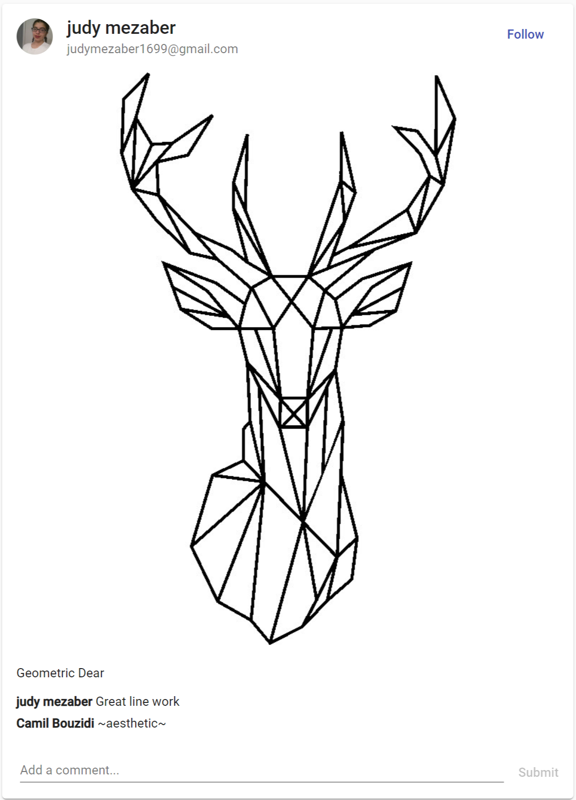
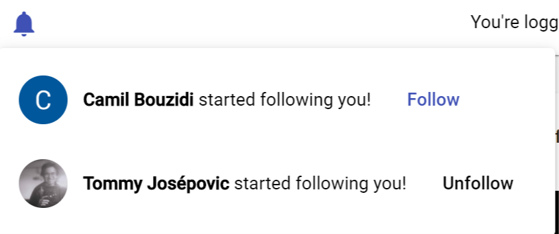
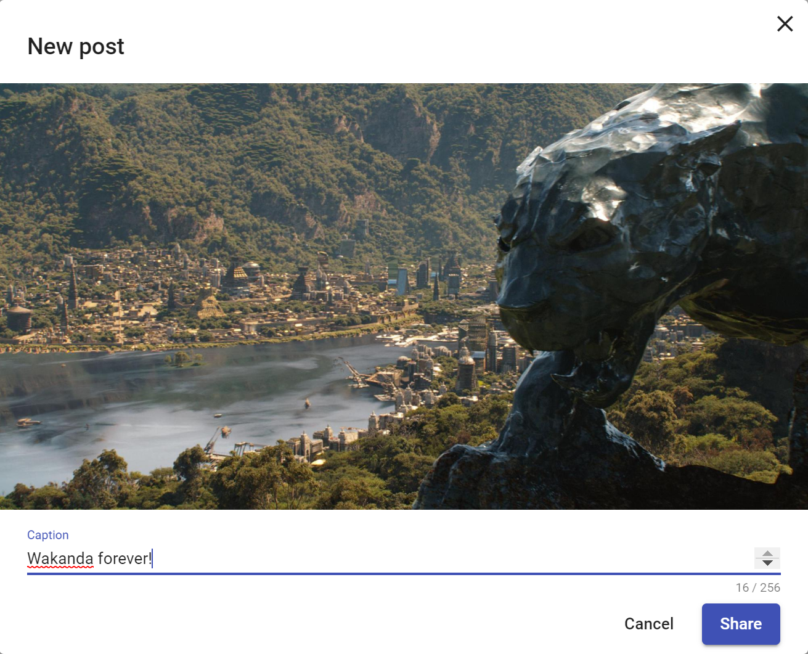

# ShutterFeed: a SOEN 341 Repo

See our [Docsify Wiki](https://docs-shutterfeed.now.sh) hosted on Zeit.

See the [ShutterFeed Web App](https://shutterfeed-soen341.web.app) deployed on Firebase.

This is the repository for ShutterFeed, our SOEN 341 group project.

## Members
* [Alexander Robitaille](https://github.com/A-Robitaille)
* **[Camil Bouzidi](https://github.com/CamilBouzidi) (Please Note: Due to a login error, most of Camil's contributions appear as [Ajithmelkote](https://github.com/Ajithmelkote) or hackerrank)**
* [Judy Mezaber](https://github.com/jmezaber)
* [Laurent Lao](https://github.com/laurentlaurent/)
* [Tommy Josépovic](https://github.com/tommy-josepovic)

## Description

ShutterFeed is an Instagram-like web app designed to let users contribute to a common feed of pictures to share them. Using their Google Account and their chosen username, a user can log in, post pictures, follow other users, comment under pictures, and even post temporary pictures that will disappear after a given time. ShutterFeed promotes collaboration since there is only a single feed, and it is completely secure: if a picture from the user's story is deleted, the ShutterFeed team does not archive it before deleting it.

By having users contribute to a single feed, we are really putting the "social" back in social medium!

## Walkthrough

When they log in for the first time, a user must pick a username.

### Insert Username Screenshot

Once they are logged in, they can see the feed and comment on it!

If they enjoy a particular user's post, they can be notified when they post something:

They can even post a picture and choose a caption:

Additionally, a user can choose to upload a ShutterFeed Story. Essentially, a ShutterFeed Story is a picture that will appear separately from the feed, so that they do not compromise the aesthetic of the feed or so that a picture that is meant to be temporary does not stay on the feed forever.

### Insert a photo of the story stuff

## Core Features
[Also available as User Stories](https://github.com/CamilBouzidi/-REDACTED-a-SOEN-341-Repo/wiki/User-Stories)
* User can post pictures
* User can comment on pictures posted
* User can follow other users

## Additional Features
[Also available as User Stories](https://github.com/CamilBouzidi/-REDACTED-a-SOEN-341-Repo/wiki/User-Stories)
* User can upload ShutterFeed Stories that last a certain amount of time and that will disappear after a number of hours set by the user
* User will have a username. If it is taken, a username generator suggests a new username.

## Languages and Techniques

### Languages
This project could benefit from having an Angular front-end and a [Firebase](https://firebase.google.com/) back-end to leverage existing work-experience from project members.

#### Style Enforcing
Since TSLint was used for this project and since it has a multi-purpose default style vetted by many developers, it was used for this project. It includes (but is not limited to):

* Variables: lower camel case
* Component classes: Upper camel case, must end with Component. 
* Component selectors: kebab case, must start with app.
* Component packages: kebab case for folder names. The files in the folder always start with the component's name in kebab case, followed by a .component term and always end with the file extension.

For a list of full rules, please consult our [TS Config File](https://github.com/laurentlaurent/ShutterFeed-a-soen-341-repo/blob/master/tsconfig.json).

### Techniques
The project is being hosted on [Firebase](https://firebase.google.com/) platform's. It allows for domain hosting, database design and storage. Moreover, it offers a authentification plug-in that uses Google Accounts.

A library called [AngularFire](https://github.com/angular/angularfire) gives developer access to Firebase functions and modules from their Angular code.

# Angular Readme

This project was generated with [Angular CLI](https://github.com/angular/angular-cli) version 9.0.1.

## Development server

Run `ng serve` for a dev server. Navigate to `http://localhost:4200/`. The app will automatically reload if you change any of the source files.

## Code scaffolding

Run `ng generate component component-name` to generate a new component. You can also use `ng generate directive|pipe|service|class|guard|interface|enum|module`.

## Build

Run `ng build` to build the project. The build artifacts will be stored in the `dist/` directory. Use the `--prod` flag for a production build.

## Running unit tests

Run `ng test` to execute the unit tests via [Karma](https://karma-runner.github.io).
We are also using Jasmine to run tests. 

## Running end-to-end tests

Run `ng e2e` to execute the end-to-end tests via [Protractor](http://www.protractortest.org/).

## Further help

To get more help on the Angular CLI use `ng help` or go check out the [Angular CLI README](https://github.com/angular/angular-cli/blob/master/README.md).

