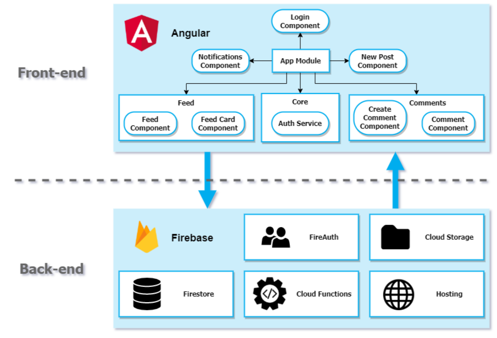

# Project Documentation

The next two pages contain our project diagrams and class diagrams:

* [User Account login with Firebase](User-Account-Login)

* [User Account and backend interaction with Firebase](User-Account-To-Backend)

Here are a few guides to help you understand the project a little better:

* [Difference Between a Post and a Story](Difference-Post-Story)

* [Unit Testing](Unit-Testing)

* [Material UI Guide](Material-UI-Guide)

Shortly put, here is how the back-end works:

Through cloud functions, we can pass data collected from the front-end into the backend's storage and database (called the Firestore).
The Firestore is extremely useful to store any information.
In the storage, pictures are stored with a link. 
In the database, a document structure is used to hold all of the information about a post. The document can hold primitive data types, but also any ADT. A link to the picture is saved, but also the person who posted the picture, as well as the caption and attached comments. 

For ShutterFeed Stories (See [the 4th User Story](User-Stories.md)), the concept is the same.
On addition to the data stored in a post document, the story document holds the date where the story was posted, how long the stories stays up on screen for, and when it is expired.