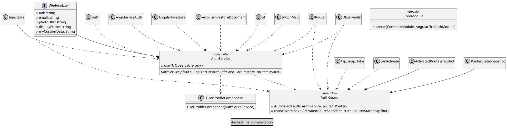

# User Account Login with Firebase

## Class Diagram

## Log

Using the [AngularFire module](https://github.com/angular/angularfire/blob/master/docs/install-and-setup.md)

Set up AngularFire module so that Firebase works with Angular

Using the [OAuth Fireship.io Guide](https://fireship.io/lessons/angularfire-google-oauth/)

Created:

* `app/core/auth.guard`
* `app/core/auth.service`
* `app/core/core.module`
* `app-routing.module`
* `app/user-profile`

Using the [AngularFirebase.com](https://angularfirebase.com/lessons/angular-firebase-authentication-tutorial-email-password-signup/) as reference.
