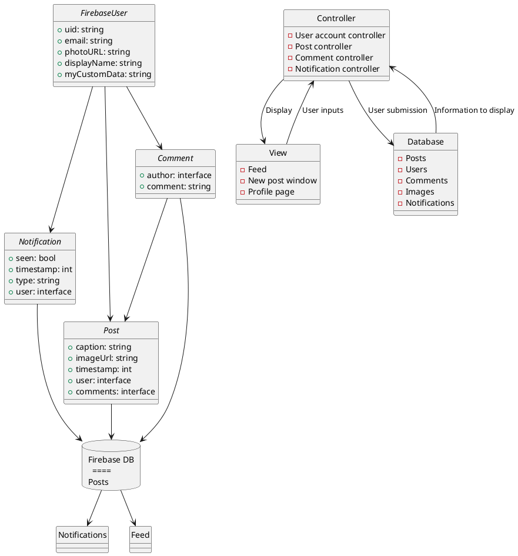

# User Account To Firebase backend

## Class Diagram

```plantuml
@startuml

interface FirebaseUser {
  + uid: string
  + email: string
  + photoURL: string
  + displayName: string
  + myCustomData: string
}

interface Notification {
  + seen: bool
  + timestamp: int
  + type: string
  + user: interface
}

class Notifications

database Firebase as "
Firebase DB
  ====
Posts
"

interface Post {
  + caption: string
  + imageUrl: string
  + timestamp: int
  + user: interface
  + comments: interface
}

interface Comment {
  + author: interface
  + comment: string
}

class Feed

Post --> Firebase
Comment --> Post
Comment --> Firebase
FirebaseUser --> Post
FirebaseUser --> Comment
Firebase --> Feed
Notification --> Firebase
Firebase --> Notifications
FirebaseUser --> Notification

class Controller{
  - User account controller
  - Post controller
  - Comment controller
  - Notification controller
}

class View{
  - Feed
  - New post window
  - Profile page
}

class Database{
  - Posts
  - Users
  - Comments
  - Images
  - Notifications
}

hide circle

View --> Controller : User inputs
Controller --> View : Display
Controller --> Database : User submission
Database --> Controller : Information to display

@enduml
```
